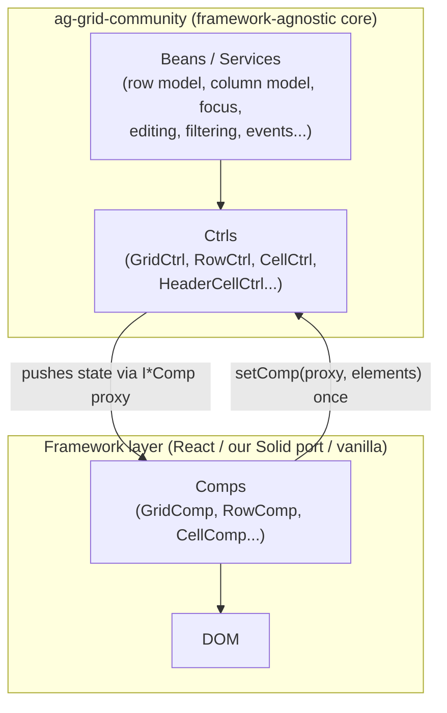

# Chapter 1 — How AG Grid is architected

AG Grid is ~20 years of data-grid engineering organized around one idea: **the
grid's logic must not know what rendering technology draws it.** Everything else
follows from how they enforce that boundary.

## The three-layer split

1. **Beans** are singleton-ish services in a dependency-injection container (the
   `Context`). Row models, column state, focus management, editing, filtering,
   events — all beans. They never touch the DOM.
2. **Ctrls** (controllers) are the per-visual-piece logic layer. A `CellCtrl`
   knows _what_ a cell should show, its CSS classes, whether it's editing — but
   not _how_ to render that. There is one ctrl type per visual concept:
   `GridCtrl`, `GridBodyCtrl`, `RowCtrl`, `CellCtrl`, `HeaderCellCtrl`, …
3. **Comps** (components) are the rendering layer, and they are _replaceable_.
   AG Grid ships vanilla-JS comps; ag-grid-react ships React comps; we ship
   Solid comps. This is exactly the seam our deep integration plugs into — and
   why the vanilla renderer can serve as a behavioral oracle for ours: same
   ctrls, different comps, so observable behavior must match.

## The ctrl ↔ comp contract (the heart of the port)

A framework comp's job, for any ctrl:

1. Render its DOM skeleton.
2. Build a **compProxy**: a plain object implementing that ctrl's `I*Comp`
   interface — a bag of setters (`setWidth`, `addOrRemoveCssClass`,
   `setUserStyles`, …). In our port each setter writes a Solid signal.
3. Call `ctrl.setComp(proxy, ...keyElements, compBean)` exactly once, when its
   root element exists.
4. From then on the comp is **passive**: the ctrl pushes state through the proxy
   whenever beans decide something changed. The comp almost never pulls state
   from the ctrl (documented exceptions: initial seeds like
   `rowCtrl.getInitialRowTop()`).

This push-only design is why the architecture survives framework swaps: the
core drives; the framework merely reflects state into whatever reactivity
system it has. React sets `useState`; we set signals; vanilla mutates DOM
directly.

**Who constructs what:** comps _construct_ the structural ctrls (`GridCtrl`,
`GridBodyCtrl`, `RowContainerCtrl`, `GridHeaderCtrl`, `TabGuardCtrl`). But
_content_ ctrls (`RowCtrl`, `CellCtrl`, `HeaderCellCtrl`…) are constructed by
core beans (row renderer, header navigation) and **handed to** the framework —
the comp receives a ctrl and wraps it. That's why those classes are type-only
exports from `ag-grid-community`: you never `new` them.

**Lifecycle scoping:** each comp passes a `compBean` (`new _EmptyBean()`
registered in the Context). Event listeners the ctrl attaches on the comp's
behalf are tied to that bean; destroying it on unmount tears them down. DI
lifetime, not framework lifetime, is the source of truth for cleanup.

## The async-framework accommodations

Vanilla comps render synchronously; React (and Solid 2.0, which batches to
microtasks) do not. The core therefore has explicit machinery for async
frameworks — all of which our port needs:

- **`ctrlsService.whenReady(...)`** — "all ctrls have comps now"; the public
  `api` is only surfaced to the user after this fires.
- **`RenderStatusService`** — lets the core ask "has the framework actually
  committed cells to the DOM yet?" (column autosize would otherwise measure
  empty cells).
- **`frameworkOverrides`** — the grab-bag of framework-specific behavior: the
  rendering-engine name, the refresh lock that queues prop updates while the
  core rebuilds views, and `wrapIncoming` hooks where React suppresses
  `flushSync` (we suppress `flush()`) during re-entrant calls.
- **Prop diffing**: framework wrappers accept all ~200 GridOptions as reactive
  props, diff them by identity, and feed changes to `_processOnChange` — the
  core applies them. The grid is _not_ re-rendered by prop changes; it is
  _commanded_ by them.

## Modules and theming (the v33 shift)

- **Modules**: every feature (sorting, filtering, row grouping…) is a module the
  user registers (`ModuleRegistry.registerModules([AllCommunityModule])` or
  per-grid `modules` prop) — mandatory since v33, for tree-shaking. The wrapper
  passes them through; it implements none of it.
- **Theming**: since v33 themes are grid _options_ (`theme: themeQuartz`), not
  CSS imports. The wrapper's only job is rendering unclassed "styled-root" div
  layers the theming engine installs styles onto (3 of them in v36) — and never
  polluting them with classes.
- **v36's `ag-stack`**: a new base package under ag-grid-community holding DOM,
  ARIA, and CSS utilities (plus the theming parts). Some symbols the framework
  layer needs come only from `ag-stack`, which is why it's a direct dependency
  of our port.

## Guided reading (do this by hand, in order)

1. `reference/ag-grid-react-v36/src/reactUi/agGridReactUi.tsx` — the entry.
   Notice: `GridCoreCreator.create(...)` returns the API _synchronously_ while
   UI mounts async; find the two `whenReady` callbacks and what each gates.
2. `reference/ag-grid-react-v36/src/reactUi/rows/rowComp.tsx` — a handed-in
   ctrl consumer. Notice the compProxy literal, the single `setComp` call, and
   that every setter just writes framework state.
3. `reference/solid-v31/grid/rows/rowComp.tsx` — the same component in Solid 1.
   Notice how mechanical the React→Solid translation is once you see the
   contract.
4. `.agent/planning/ARCHITECTURE.md` §2–3 — the full contract and creation flow
   as it applies to our port.

## Checkpoints

1. Why does the ctrl push state into the comp instead of the comp pulling state
   from the ctrl? What would break in an async framework if comps pulled?
2. `RowCtrl` is a type-only export but `GridBodyCtrl` is a runtime export. What
   does that difference tell you about who constructs each?
3. When a user's `rowData` prop changes, what path does that change take before
   rows visually update? (Name the function the wrapper calls and what layer
   reacts.)
4. Why can the vanilla renderer serve as a _behavioral oracle_ for our Solid
   comps — and what class of bug would it fail to catch?
